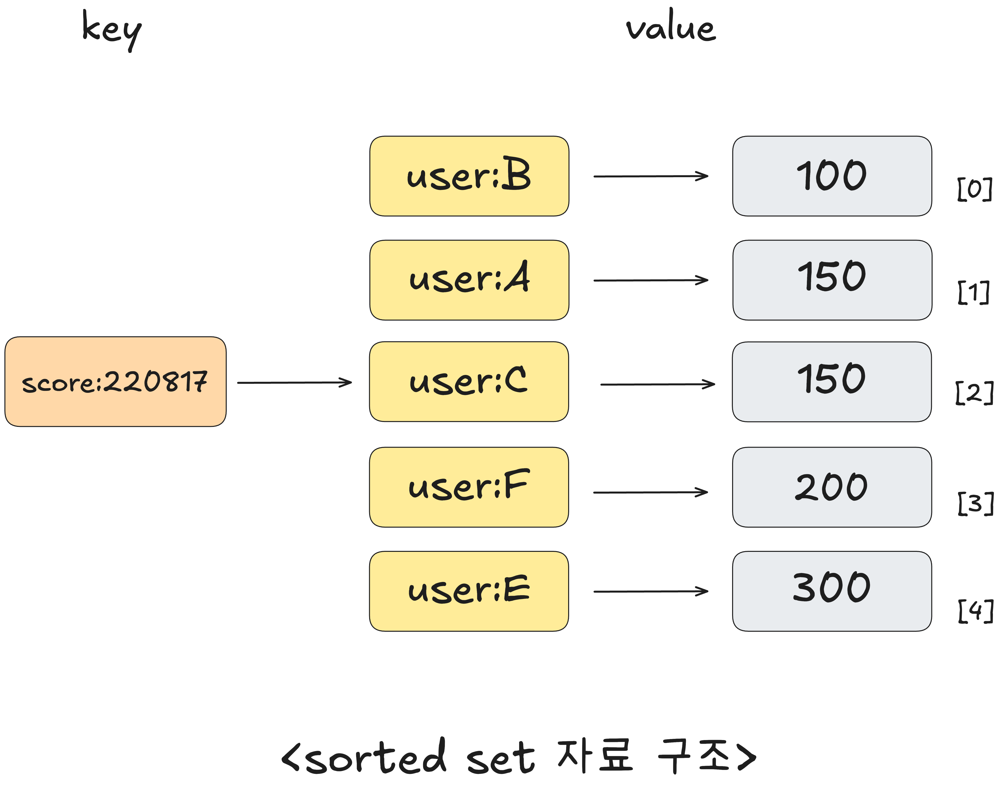

# 03장 레디스 기본 개념

## 레디스의 자료 구조

### string
레디스에서 데이터를 저장할 수 있는 가장 간단한 자료 구조  
최대 512MB 문자열 데이터를 저장할 수 있으며, 이진 데이터를 포함하는 모든 종류의 문자열이 binary-safe하게 처리되기 때문에  
JPEG 이미지 같은 바이트 값, HTTP 응답값 등 다양한 데이터를 저장할 수 있다. 

<details> 
<summary> ※ binary-safe란 </summary>
일반적으로 문자열을 처리하는 함수나 전송 방식은  
문자열 끝을 \0(null 문자)로 인식하거나 특정 문자 인코딩(UTF-8 등)을 기준으로 동작함.

이 경우, 텍스트가 아닌 순수 이진 데이터를 처리하면 중간에 \0이 있거나 예상치 못한 바이트 때문에 데이터가 잘리는 문제가 발생할 수 있는데,  
binary-safe 함수는 데이터 안에 null문자 여부에 상관 없이 전체 길이를 명시적으로 사용하여 안전하게 처리함.

</details>

string은 키와 실제 저장되는 아이템이 일대일로 연결되는 유일한 자료구조

SET 커멘드는 string 데이터를 저장하며, GET 커멘드는 저장된 string 데이터를 조회할 수 있다.

```
> SET hello world
OK

> GET hello
"world"
```

hello라는 키에 이미 다른 값이 저장되어 있었다면 새로 입력된 값으로 대체된다.

SET과 함께 NX 옵션을 사용하면 지정된 키가 없을 때만 새로운 키를 저장한다.

```
> SET hello newval NX
(nil)
```

XX 옵션을 사용하면 반대로 이미 키가 있을 때만 새로운 값으로 덮어 쓰며, 새로운 키가 생성되지 않도록 동작한다.

```
> SET hello newval XX
OK

> GET hello
"newval"
```

string 자료구조에는 모든 문자열 데이터를 저장할 수 있기 때문에 숫자 형태의 데이터 저장도 가능하다.

INCR, INCRBY 같은 커맨드를 사용하면 string 자료구조에 저장된 숫자를 원자적으로 조작할 수 있다.

```
> SET counter 100
OK

> INCR counter
(integer) 101

> INCR counter
(integer) 102

> INCRBY counter 50
(integer) 152
```

DECR, DECRBY 커맨드는 동일한 방식으로 데이터를 감소시킨다.

---

MSET, MGET 커맨드를 이용하면 한 번에 여러 키를 조작할 수 있다.
```
> MSET a 10 b 20 c 30
OK

> MGET a b c
1) "10"
2) "20"
3) "30"
```

### list
레디스에서 리스트는 순서를 가지는 문자열의 목록이다. 최대 42억여 개의 아이템을 저장할 수 있다.

일반적으로 알고 있는 다른 배열처럼 인덱스를 이용해 데이터에 직접 접근할 수 있고, 스택과 큐로서 사용할 수 있다.

LPUSH 커맨드는 list의 왼쪽(head)에 데이터를 추가, RPUSH 커맨드는 list의 오른쪽(tail)에 데이터를 추가한다.

LRANGE 커맨드를 이용하면 list에 들어 있는 데이터를 조회할 수 있다.

```
> LPUSH mylist E
(integer) 1

> RPUSH mylist B
(integer) 2

> LPUSH mylist D A C B A
(integer) 7

> LRANGE mylist 0 -1
1) "A"
2) "B"
3) "C"
4) "A"
5) "D"
6) "E"
7) "B"

> LRANGE mylist 0 3
1) "A"
2) "B"
3) "C"
4) "A"
```

하나의 PUSH 커맨드로 여러 아이템을 저장하는 것도 가능

LRANGE는 시작과 끝 아이템의 인덱스를 인수로 받는다.  
가장 오른쪽에 있는 아이템의 인덱스는 -1, 그 앞의 인덱스는 -2다.(like Python)

---

LPOP 커맨드를 사용하면 list에 저장된 첫 번째 아이템을 반환하는 동시에 list에서 삭제한다.  
숫자와 함께 사용하면 지정한 숫자만큼의 아이템을 반복해서 반환한다.

```
> LPOP mylist
"A"

> LPOP mylist 2
1) "B"
2) "C"
```

---

LTRIM 커맨드는 시작과 끝 아이템을 인자로 받아 지정한 범위에 속하지 않는 아이템을 삭제한다.  
삭제한 아이템을 반환하지는 않는다.

```
> LRANGE mylist 0 -1
1) "A"
2) "D"
3) "E"
4) "B"

> LTRIM mylist 0 1
OK

> LRANGE mylist 0 -1
1) "A"
2) "D"
```

---

LPUSH와 LTRIM 커맨드를 함께 사용하면 고정된 길이의 큐를 쉽게 유지할 수 있다.

list에 최대 1000개의 데이터를 보관하고 싶다면
```
LPUSH logdata <data>
LTRIM logdata 0 999
```

데이터의 개수가 1001개가 되기 전까지는 1000번 인덱스가 없으므로 LTRIM 커맨드를 사용해도 아무런 동작이 일어나지 않는다.

---

list의 양 끝에 데이터를 넣고 빼는 LPUSH, RPUSH, LPOP, RPOP 커맨드는 O(1)로 처리할 수 있어 매우 빠르게 수행되나, 인덱스나 데이터를 이용해 list의 중간 데이터에 접근할 때는 O(N)으로 처리된다. (LinkedList인가봐)

---

LINSERT 커맨드는 원하는 데이터의 앞이나 뒤에 데이터를 추가할 수 있다.
```
> LRANGE mylist 0 -1
1) "A"
2) "B"
3) "C"
4) "D"

> LINSERT myslit BEFORE B E
(integer) 5

> LRANGE mylist 0 -1
1) "A"
2) "E"
3) "B"
4) "C"
5) "D"
```

---

LSET 커맨드는 지정한 인덱스의 데이터를 신규 입력하는 데이터로 덮어 쓴다.  
범위를 넘어서면 에러를 반환한다.

```
> LSET mylist 2 F
OK

> LRANGE mylist 0 -1
1) "A"
2) "E"
3) "F"
4) "C"
5) "D"
```

---

LINDEX 커맨드를 사용하면 해당 인덱스에 담긴 데이터를 확인할 수 있다.
```
> LINDEX mylist 3
"C"
```

### hash

레디스에서 hash는 필드-값 쌍을 가진 아이템의 집합이다.

하나의 hash 자료구조 내에서 아이템을 필드-값 쌍으로 저장된다.  
필드는 하나의 hash 내에서 유일하며, 필드와 값 모두 문자열 데이터로 저장된다.


<table>
    <thead>
        <td> Product ID </td>
        <td> Product Name </td>
        <td> Product Type ID </td>
        <td> Product Version </td>
    </thead>
    <tr>
        <td> 123 </td>
        <td> Happy Hacking </td>
        <td> 35 </td>
        <td> 2002 </td>
    </tr>
        <tr>
        <td> 234 </td>
        <td> Track Ball </td>
        <td> 32 </td>
        <td> - </td>
    </tr>
</table>

hash는 객체를 표현하기 적절한 자료 구조이기 때문에 관계형 데이터베이스의 테이블 데이터로 변환하는 것도 간편하다.

칼럼이 고정된 관계형 데이터베이스 테이블과 달리, hash의 각 아이템은 각기 다른 필드를 가질 수 있다.  
동적으로 추가도 가능하다.

HSET 커맨드를 사용하면 hash에 아이템을 저장할 수 있으며, 한 번에 여러 필드-값 쌍을 저장할 수도 있다.

```
> HSET Product:123 Name "Happy Hacking"
(integer) 1

> HSET Product:123 TypeID 35
(integer) 1

> HSET Product:123 Version 2002
(integer) 1

> HSET Product:234 Name "Track Ball" TypeID 32
(integer) 2
```

HGET 커맨드로 가져올 수 있다.  
HMGET 커맨드를 이용하면 하나의 hash 내에서 다양한 필드의 값을 가져올 수 있다.  
HGETALL 커맨드는 hash 내의 모든 필드-값 쌍을 차례로 반환한다.
```
> HGET Productt:123 TypeID
"35"

> HGET Product:234 Name TypeID
1) "Track Ball"
2) "32"

> HGETALL Product:234
1) "Name"
2) "Track Ball"
3) "TypeID"
4) "32"
```

### set
레디스에서 set은 정렬되지 않은 문자열의 모음이다.  
하나의 set 자료 구조 내에서 아이템은 중복해서 저장되지 않으며  
교집합, 합집합, 차집합 등의 집합 연산과 관련한 커맨드를 제공한다.

SADD 커맨드를 사용하면 set에 아이템을 저장할 수 있다.
```
> SADD myset A
(integer) 1

> SADD myset A A A C B D D E F F F F G
(integer) 6

> SMEMBERS myset
1) "D"
2) "F"
3) "C"
4) "G"
5) "B"
6) "A"
7) "E"
```

SADD 커맨드는 저장되는 아이템 수를 반환, SMEMBERS 커맨드는 저장된 전체 아이템을 출력하는데, 저장한 순서와 관계 없이 출력되는 것을 확인할 수 있다.

SREM 커맨드를 이용하면 원하는 데이터를 삭제할 수 있으며, SPOP 커맨드는 set 내부의 아이템 중 하나를 랜덤으로 반환하는 동시에 그 아이템을 삭제한다.

```
> SREM myset B
(integer) 1

> SPOP myset
"E"
```

합집합, 교집합, 차집합은 SUNION, SINTER, SDIFF 커맨드로 수행할 수 있다.

### sorted set

score 값에 따라 정렬되는 고유한 문자열의 집합이다.



모든 아이템은 스코어-값 쌍을 가지며, 같은 스코어를 가진 아이템은 데이터의 사전 순으로 정렬돼 저장된다.

list 처럼 인덱스를 이용해 각 아이템에 접근할 수 있다.  
sorted set에서는 인덱스를 이용해 데이터에 접근하는 작업이 O(log(n))으로 수행되어 인덱스로 데이터에 접근할 일이 많다면 list 보다 sorted set을 이용하는 것이 더 효율적이다.

ZADD 커맨드를 이용하면 sorted set에 아이템을 저장할 수 있다.  
스코어-값 쌍으로 입력해야 한다.

```
> ZADD score:220817 100 user:B
(integer) 1

> ZADD score:220817 150 user:A 150 user:C 200 user:F 300 user:E
(integer) 4
```

저장하고자 하는 데이터가 이미 sorted set에 저장되어 있다면 스코어만 업데이트 되며, 아이템이 재정렬된다.

키가 존재하지 않을 때는 sorted set 자료 구조를 새로 생성하며, 키가 존재하지만 sorted set이 아닐 때는 오류를 반환한다.

ZADD 옵션
* XX: 아이템이 이미 존재할 때만 스코어를 업데이트
* NX: 아이템이 존재하지 않을 때만 신규 삽입, 기존 아이템의 스코어를 업데이트 하지 않음
* LT: 업데이트하고자 하는 스코어가 기존 스코어보다 작을 때만 업데이트, 아이템이 존재하지 않는 경우 신규 삽입
* GT: 업데이트하고자 하는 스코어가 기존 스코어보다 클 때만 업데이트, 아이템이 존재하지 않는 경우 신규 삽입

---
ZRANGE 커맨드를 사용하면 sorted set에 저장된 데이터를 조회할 수 있다.  
start, stop 으로 표현하는 범위를 항상 입력해야 한다.

```
ZRANGE key start stop [BYSCORE | BYLEX] [REV] [LIMIT offset count] [WITHSCORES]
```

#### 인덱스로 데이터 조회


```
> ZRANGE score:220817 1 3 WITHSCORES
1) "user:A"
2) "150"
3) "user:C"
4) "150"
5) "user:F"
6) "200"

> ZRANGE score:220817 1 3 WITHSCORES REV
1) "user:F"
2) "200"
3) "user:C"
4) "150"
5) "user:A"
6) "150"
```

WITHSCORE 옵션을 사용하면 데이터와 스코어 값이 차례로 출력되며, REV 옵션을 사용하면 데이터가 역순으로 출력된다.

ZRANGE 커맨드에 BYSCORE 옵션을 사용하면 스코어를 이용해 데이터를 조회할 수 있다.
```
> ZRANGE score:220817 100 150 BYSCORE WITHSCORES
1) "user:B"
2) "100"
3) "user:A"
4) "150"
5) "user:C"
6) "150"
```

인수로 전달하는 스코어에 ( 문자를 추가하면 해당 스코어를 포함하지 않는 값만 조회할 수 있다.
```
ZRANGE score:220817 (100 150 BYSCORE WITHSCORES

ZRANGE score:220817 100 (150 BYSCORE WITHSCORES
```

start, stop 자리에 -inf, +inf 값을 사용할 수도 있다.

```
ZRANGE score:220817 200 +inf BYSCORE WITHSCORES
```

#### 사전 순으로 데이터 조회


스코어가 같으면 데이터는 사전 순으로 정렬된다고 했다.  
이 특성을 이용해 스코어가 같을 때 BYLEX 옵션을 사용하면 사전식 순서를 이용해 특정 아이템을 조회할 수 있다.

```
> ZRANGE mySortedSet (b (f BYLEX
banana
candy
dream
egg
```

start와 stop 에는 사전 순으로 비교하기 위한 문자열을 전달해야 하며, ( 문자나 [ 문자를 함께 입력해야 한다.  
입력한 문자열을 포함하려면 (, 포함하지 않을 때는 [를 사용한다.

사전식 문자열의 가장 처음은 -, 가장 마지막은 + 문자로 대체할 수 있기 때문에
```
ZRANGE <key> - + BYLEX
```
커맨드는 sorted set에 저장된 모든 데이터를 조회하겠다는 것을 의미한다.

### 비트맵

비트맵은 string 자료 구조에 bit 연산을 수행할 수 있도록 확장한 형태다.

SETBIT로 비트를 저장할 수 있으며, GETBIT 커맨드로 저장된 비트를 조회할 수 있다.  
한 번에 여러 비트를 SET하려면 BITFIELD 커맨드를 사용하면 된다.

```
> SETBIT mybitmap 2 1
(integer) 1

> GETBIT mybitmap 2
(integer) 1

> BITFIELD mybitmap SET u1 6 1 SET u1 10 1 SET u1 14 1
1) (integer) 1
2) (integer) 1
3) (integer) 1
```
---
BITCOUNT 커맨드를 이용하면 1로 설정된 비트의 개수를 카운팅할 수 있다.
```
BITCOUNT mybitmap
(integer) 4
```

### hyperloglog
집합의 원소 개수인 카디널리티를 추정할 수 있는 자료 구조다.

일반적으로 set과 같은 데이터 구조에서는 중복을 피하기 위해 저장된 데이터를 모두 기억하는데, hyperloglog는 입력되는 데이터 자체를 저장하지 않고, 자체적인 방법으로 데이터를 변경해 처리한다.

따라서 hyperloglog 자료 구조는 저장되는 데이터 개수에 구애받지 않고 계속 일정한 메모리를 유지할 수 있으며, 중복되지 않는 유일한 원소 개수를 계산할 수 있다.

하나의 hyperloglog 자료 구조는 최대 12KB의 크기를 가지며, 레디스에서 카디널리티 추정 오차는 0.81%로, 비교적 정확하게 데이터를 추정할 수 있다.

PFADD 커맨드로 hyperloglog에 아이템을 저장할 수 있으며, PFCOUNT 커맨드로 저장된 아이템의 개수, 카디널리티를 추정할 수 있다.

```
> PFADD members 123
(integer) 1

> PFADD members 500
(integer) 1

> PFADD members 12
(integer) 1

> PFCOUNT members
(integer) 3
```

[hyperloglog 참고](https://d2.naver.com/helloworld/711301)

### geospatial
경도, 위도 데이터 쌍의 집합으로, 간편하게 지리 데이터를 저장할 수 있다.  
내부적으로 데이터는 sorted set으로 저장되며, 하나의 자료 구조 안에 키는 중복돼 저장되지 않는다.

```
> GEOADD travel 14.399698913595286 50.09924276349484 prague
(integer) 1

> GEOADD travel 127.0016985 37.5642135 seoul -122.43454762275572 37.78530362582044 SanFrancisco
(integer) 2
```

```
GEOADD <key> 경도 위도 member
```
순서로 저장되며, XX, NX 옵션을 사용할 수 있다.

GEOPOS 커맨드를 이용하면 저장된 위치 데이터를 조회할 수 있으며, GEODIST 커맨드를 사용하면 두 아이템 사이의 거리를 반환할 수 있다.
```
> GEOPOS travel prague
1) "14.399698913595286"
2) "50.09924276349484"

> GEODIST travel seoul prague KM
"8252.9957"
```

GEOSEARCH 키워드를 이용하면 특정 위치를 기준으로 원하는 거리 내에 있는 아이템을 검색할 수 있다.  
BYRADIUS 옵션을 사용하면 반경 거리를 기준으로, BYBOX 옵션을 사용하면 직사각형 거리를 기준으로 데이터를 조회할 수 있다.

### stream

stream은 레디스를 메시지 브로커로서 사용할 수 있게 하는 자료 구조다.  
카프카에서처럼 소비자 그룹 개념을 도입해 데이터를 분산 처리할 수 있는 시스템이다.


## 레디스에서 키를 관리하는 법

### 키의 자동 생성과 삭제
stream이나 set, sorted set, hash 와 같이 하나의 키가 여러 개의 아이템을 가지고 있는 자료 구조에서는 명시적으로 키를 생성하거나 삭제하지 않아도 키는 알아서 생성되고 삭제된다.

키의 생성과 삭제는 다음 세 가지 공통적인 규칙을 따른다.

1. 키가 존재하지 않을 때 아이템을 넣으면 아이템을 삽입하기 전에 빈 자료 구조를 생성한다.

    ```
    > DEL mylist
    (integer) 1
    
    > LPUSH mylist 1 2 3
    (integer) 3
    ```

    키가 존재하지 않을 때 LPUSH 커맨드를 사용해 데이터를 입력하면 명시적으로 키를 생성하는 작업을 하지 않아도 mylist라는 이름의 list 자료 구조가 생성된다.

    저장하고자 하는 키에 다른 자료 구조가 이미 생성되어 있을 때 아이템을 추가하는 작업은 에러를 반환한다.
    ```
    > SET hello world
    OK

    > LPUSH hello 1 2 3
    (error) WRONGTYPE Operation against a key holding the wrong kind of value

    > TYPE hello
    string
    ```

    hello는 string에 대한 key, LPUSH는 list에 대한 커맨드이므로 에러

2. 모든 아이템을 삭제하면 키도 자동으로 삭제된다.(stream 예외)

    ```
    > LPUSH mylist 1 2 3
    (integer) 3

    > EXISTS mylist
    (integer) 1

    > LPOP mylist
    "3"

    > LPOP mylist
    "2"

    > LPOP mylist
    "1"

    > EXISTS mylist
    (integer) 0
    ```

3. 키가 없는 상태에서 키 삭제, 아이템 삭제, 자료 구조 크기 조회 같은 읽기 전용 커맨드를 수행하면 에러를 반환하는 대신 키가 있으나 아이템이 없는 것처럼 동작한다.

    ```
    > DEL mylist
    (integer) 0

    > LLEN mylist
    (integer) 0

    > LPOP mylist
    (nil)
    ```

### 키와 관련된 커맨드

#### 키의 조회

##### EXISTS

```
EXISTS key [key ...]
```

EXISTS 는 키가 존재하는지 확인하는 커맨드다.

##### KEYS
```
KEYS pattern
```

KEYS 커맨드는 레디스에 저장된 모든 키를 조회하는 커맨드다.  
패턴은 글롭 패턴(Glob Pattern, Globs) 스타일로 동작한다.

[Globs 참고](https://www.daleseo.com/glob-patterns/)

<details>
    <summary> ※ KEYS는 위험하다 </summary>

    레디스에 100만 개의 키가 저장되어 있다면 모든 키의 정보를 반환한다.  
    레디스는 싱글 스레드로 동작하기 때문에 실행 시간이 오래 걸리는 커맨드를 수행하는 동안  
    다른 클라이언트에서 들어오는 커맨드는 모두 차단된다.
</details>

##### SCAN
```
SCAN cursor [MATCH pattern] [COUNT count] [TYPE type]
```

SCAN은 KEYS를 대체해 키를 조회할 때 사용할 수 있는 커맨드다.  
SCAN은 cursor를 기반으로 특정 범위의 키만 조회할 수 있기 때문에 비교적 안전하게 사용할 수 있다.

```
> SCAN 0
1) "17"
2)  1) "key:12"
    2) "key:8"
    3) "key:4"
    4) "key:14"
    5) "key:16"
    6) "key:17"
    7) "key:15"
    8) "key:10"
    9) "key:13"
    10) "key:17"
    11) "key:1"

> SCAN 17
1) 0
2)  1) "key:5"
    2) "key:18"
    3) "key:0"
    4) "key:2"
    5) "key:19"
    6) "key:13"
    7) "key:6"
    8) "key:9"
    9) "key:11"
```

처음으로 SCAN 커맨드로 키를 조회할 때 커서에 0을 입력했다.  
첫 번째로 반환된 17은 다음 SCAN 커맨드에 인수로 사용해야 할 커서 값이다.  
그 다음으로 반환되는 데이터는 저장된 키의 list다. 

두 번째 SCAN 커맨드는 다음 커서 값으로 0을 반환했으며, 이것은 레디스에 저장된 모든 키를 반환해서 더 이상 검색할 키 값이 없다는 것을 의미한다.

기본적으로 한 번에 반환되는 키의 개수는 10개 정도지만, COUNT 옵션으로 개수를 조절할 수 있다.

레디스는 메모리를 스캔하며 데이터가 저장된 형상에 따라 몇 개의 키를 더 읽는 것이 효율적이라고 판단되면 1~2개의 키를 더 읽은 뒤 함께 반환하기도 한다.

MATCH 옵션을 사용하면 KEYS에서처럼 입력한 패턴에 맞는 키 값을 조회한다.
```
> KEYS *11*
```

TYPE 옵션을 이용하면 지정한 타입의 키만 조회할 수 있다.
```
> SCAN 0 TYPE zset
1) "48"
2) (empty array)

> SCAN 48 TYPE zset
1) "120"
2) (empty array)

> SCAN 0 TYPE zset count 1000
1) "0"
2)  1) "zkey"
    2) "geokey"
```

---

SCAN과 비슷한 커맨드로 SSCAN, HSCAN, ZSCAN이 있다.  
각각 set, hash, sorted set에서 아이템을 조회하기 위해 사용되는  
SMEMBERS, HGETALL, ZRANGE WITHSCORE를 대체해서 서버에 부담을 줄이기 위해 사용하는 커맨드이다.

##### SORT
```
SORT key [BY pattern] [LIMIT offset count] [GET pattern [GET pattern ...]] [ASC | DESC] [ALPHA] [STORE destination]
```

list, set, sorted set에서만 사용할 수 있는 커맨드로, 키 내부의 아이템을 정렬해 반환한다.  
LIMIT 옵션으로 일부 데이터만 조회가 가능하고, ASC/DESC 로 정렬 순서를 변경할 수 있다.  
정렬할 대상이 문자열인 경우 ALPHA 옵션으로 데이터를 사전순 정렬해 조회할 수 있다.

##### RENAME / RENAMENX

```
RENAME key newkey
RENAMENX key newkey
```

키의 이름을 변경할 때 사용, RENAMENX는 오직 변경할 키가 존재하지 않을 때에만 동작한다.  
RENAME의 경우 newkey 값에 이미 할당된 키가 있으면 덮어씌움

##### COPY
```
COPY source destination [DB destination-db] [REPLACE]
```

source에 지정된 키를 destination 키에 복사한다.  
destination에 지정한 키가 이미 있는 경우 에러 발생, REPLACE 옵션을 사용하면 destination 키를 삭제한 뒤 값을 복사하여 에러가 발생하지 않는다.

```
> SET B BANANA
OK

> COPY B BB
(integer) 1

> GET B
"BANANA"

> GET BB
"BANANA"
```

##### TYPE
```
TYPE key
```

지정한 키의 자료 구조 타입을 반환

##### OBJECT
```
OBJECT <subcommand> [<arg> [value] [opt] ...]
```

키에 대한 상세 정보를 반환

#### 키의 삭제

##### FLUSHALL
```
FLUSHALL [ASYNC | SYNC]
```

레디스에 저장된 모든 키를 삭제한다.

ASYNC 옵션을 사용하면 flush가 백그라운드로 실행되고, 커맨드가 수행됐을 때 존재했던 키만 삭제해서 flush 되는 중 새로 생성된 키는 삭제하지 않는다.

##### DEL
```
DEL key [key ...]
```

키와 키에 저장된 모든 아이템을 삭제

##### UNLINK
```
UNLINK key [key ...]
```

DEL과 비슷하게 키와 데이터를 삭제하는 커맨드  
백그라운드에서 다른 스레드에 의해 처리되며, 우선 키와 연결된 데이터의 연결을 끊는다.

set, sorted set 처럼 하나의 key에 여러 아이템이 저장된 자료 구조의 경우 DEL을 사용하면 레디스 인스턴스에 영향을 줄 수 있다.  
수행 시간 동안 다른 클라이언트는 아무런 커맨드를 사용할 수 없다.

따라서 키에 저장된 아이템이 많은 경우 DEL보다 UNLINK를 사용하는 것이 좋다.

#### 키의 만료 시간

##### EXPIRE
```
EXPIRE key seconds [ NX | XX | GT | LT ]
```

키가 만료될 시간을 초 단위로 정의가능
* NX: 만료시간이 정의되어 있지 않은 경우에만 수행
* XX: 만료시간이 정의되어 있을 때만 수행
* GT: 현재 키가 가지고 있는 만료 시간보다 새로 입력한 초가 더 클 때만 수행
* LT: 현재 키가 가지고 있는 만료 시간보다 새로 입력한 초가 더 작을 때만 수행

##### EXPIREAT
```
EXPIREAT key unix-time-seconds [ NX | XX | GT | LT ]
```

키가 특정 유닉스 타임스탬프에 만료될 수 있도록 지정한다.

##### EXPIRETIME
```
EXPIRETIME key
```

키가 삭제되는 유닉스 타임스탬프를 초 단위로 반환한다.  
키가 존재하지만 만료 시간이 설정되어 있지 않은 경우 -1, 키가 없을 경우 -2 반환

##### TTL
```
TTL key
```

키가 몇 초 뒤에 만료되는지 반환한다.  
키가 존재하지만 만료 시간이 설정되어 있지 않은 경우 -1, 키가 없을 경우 -2 반환

##### 그 외
PEXPIRE, PEXPIREAT, PEXPIRETIME, PTTL은 밀리초 단위로 계산된다.