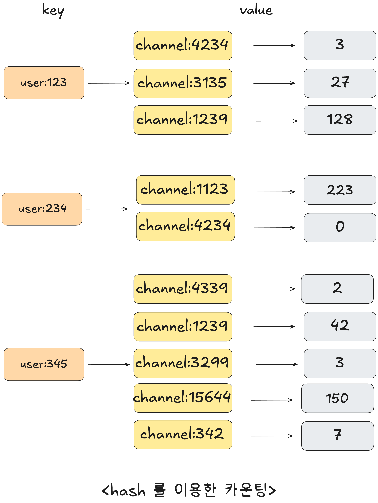

# 04장 레디스 자료 구조 활용 사례

레디스의 커맨드가 제공하는 여러 커맨드는 대부분 애플리케이션 레벨에서도 구현될 수 있겠지만,  
레디스 자료 구조에 내장된 함수를 이용해 원하는 기능을 사용하면 데이터를 애플리케이션의 메모리 영역으로 가져간 뒤 가공하는 데에 걸리는 시간을 줄일 수 있다.

## sorted set을 이용한 실시간 리더보드

- 절대적 리더보드(서비스의 모든 유저를 정렬시켜 상위권의 목록만을 표시)
- 상대적 리더보드(사용자마다 다른 데이터 표시)  
    ex. 
    1. 유저와 인접해있는 경쟁자들의 스토어 표시
    2. 특정 그룹 내에서의 순위를 보여주는 리더보드

리더보드는 사용자 수에 민감, 실시간으로 반영되어야 함.

일별 리더보드를 도입하기 위해 daily-score:<날짜>를 이용해 sorted set 키를 만들고
```
> ZADD daily-score:220817 28 player:286
(integer) 1

> ZADD daily-score:220817 400 player:234
(integer) 1

> ZADD daily-score:220817 45 player:101
(integer) 1

> ZADD daily-score:220817 357 player:24
(integer) 1

> ZADD daily-score:220817 199 player:143
(integer) 1
```

`ZRANGE` 커맨드로 조회할 수 있다.
```
> ZRANGE daily-score:220817 0 -1 WITHSCORES
1) "player:286"
2) "28"
3) "player:101"
4) "45"
5) "player:143"
6) "199"
7) "player:24"
8) "357"
9) "player:234"
10) "400"
```

### 데이터 업데이트

score 업데이트를 할 때는
```
> ZADD daily-score:220817 200 player:286
(integer) 1
```

set이기 때문에 데이터 중복저장 없이 스코어만 업데이트 된 후, 재정렬이 일어난다.

```
> ZINCRBY daily-score:220817 100 player:24
(integer) 1
```

`ZINCRBY`를 사용할 수도 있다.

### 랭킹 합산

관계형 데이터베이스에서 이런 주간 누적 랭킹을 구현하려면 하나의 테이블에서 일자에 해당하는 데이터를 모두 가져온 뒤, 선수별로 합치고, 정렬하는 작업을 해야 하지만

레디스에서는 `ZUNIONSTORE` 커맨드를 이용해 간단히 구현할 수 있다.

`ZUNIONSTORE` <생성할 키 이름> <합산할 키 개수> <합산할 키> ... 와 같이 사용가능

```
> ZUNIONSTORE weekly-score:2208-3 3 daily-score:220815 daily-score:220816 daily-score:220817
(integer) 4
```

```
> ZREVRANGE weekly-score:2208-3 0 -1 withscores
1) "player:24"
2) "650"
3) "player:234"
4) "600"
...
```

`ZUNIONSTORE`를 사용할 때 스코어에 가중치를 줄 수 있다.  
만약 8월 16일에 스코어 두 배 이벤트가 있었다면

```
> ZUNIONSTORE weekly-score:2208-03 3 daily-score:220815 daily-score:220816 daily-score:220817 weights 1 2 1
```

## sorted set을 이용한 최근 검색 기록

최근 검색 기록 기능을 구현하기 위해 다음과 같은 요구사항으로
- 유저별로 다른 키워드 노출
- 검색 내역은 중복 제거
- 가장 최근 검색한 5개의 키워드만 사용자에게 노출

관계형 데이터베이스의 테이블에 데이터를 저장한다면
```sql
SELECT * FROM keyword WHERE user_id = 123 ORDER BY reg_date DESC LIMIT 5;
```

같은 쿼리를 실행하여 조회할 것이다.

또한 테이블에 데이터를 저장할 때는 기존에 사용자가 같은 키워드를 검색했었는지 확인한 뒤 업데이트하는 작업을 추가해야 하며, 데이터가 무한으로 쌓이는 것을 막기 위해 주기적으로 오래된 검색 기록은 삭제하는 작업이 필요할 수 있다.

데이터를 가져올 때는 검색한 시점을 기준으로 정렬해야 하기 때문에 많은 데이터를 테이블에서 관리하기 까다롭다.

sorted set은 set이기 때문에 중복을 허용하지 않으며, 스코어로 시간을 사용한다면 검색 기록으로 정렬할 수 있다.

예를 들어 ID가 123인 유저가 2022년 11월 6일 14시 35분 01초에 코듀로이라는 키워드를 검색했다면, 데이터는 다음과 같이 저장한다.
```
> ZADD search-keyword:123 20221106143501 코듀로이
(integer) 1
```

`ZREVRARNGE` 커맨드를 이용해 가장 최근 검색한 순서대로 5개 데이터를 가져올 수 있다.
```
> ZREVRANGE search-keyword:123 0 4 withscores
기모후드
20221106152734
코듀로이
20221106143501
반지갑
20221105221002
에나멜
20221105220954
실버
20221105220913
```

같은 아이템의 데이터를 입력한다면 자동으로 스코어만 업데이트되어 재정렬될 것이다.

너무 많은 데이터가 쌓이는 것을 방지하기 위해, 최근 5개의 검색어를 제외하고 삭제하는 작업은  
음수 인덱스와 `ZREMRANGEBYRANK` 커맨드를 이용해 쉽게 구현할 수 있다.

```
> ZADD search-keyword:123 20221106165302 버킷햇
1

> ZREMRANGEBYRANK search-keyword -6 -6
1
```

아이템은 시간 순으로 저장되기 때문에 가장 오래된 검색어는 index 0에 저장되는데,  
음수 인덱스를 사용하지 않는다면 아이템의 개수가 5가 넘는지를 확인한 후 index 0의 아이템을 삭제해야 한다.

인덱스로 -6 을 사용하면 데이터가 6개째 저장되었을 때 가장 오래된 데이터인 0번 인덱스가 삭제되므로 간편하다.

아이템의 개수가 5개보다 많지 않을 때에는 -6번째 인덱스가 존재하지 않기 때문에 영향을 주지 않는다.

## sorted set을 이용한 태그 기능

블로그 게시글을 작성할 때 태그를 추가하고자 한다.

관계형 데이터베이스만을 이용한다면 두 개의 테이블이 추가로 필요하다.(태그 테이블, 게시물-태그 테이블)

레디스에서 set을 사용하면 간단하게 게시물의 태그 기능을 사용할 수 있다.  

게시글에 달리는 태그를 추가
```
> SADD post:47:tags IT REDIS DataStore
3

> SADD post:22:tags IT Python DataStore
2
```

그리고 각 태그가 포함된 게시글 추가
```
> SADD tag:IT:posts 47 22
2

> SADD tag:REDIS:posts 47
1

> SADD tag:DataStore:posts 47 22
2

...
``` 

`SMEMBERS` 커맨드를 이용하면 특정 태그를 가지고 있는 포스트를 쉽게 확인할 수 있다.
```
> SMEMBERS tag:IT:posts
1) "47"
2) "22"
```

`SINTER` 커맨드를 이용하면 특정 set의 교집합을 확인할 수 있다.
```
> SINTER tag:IT:posts tag:DataStore:posts
1) "47"
2) "22"
```

관계형 데이터베이스만을 이용해 이런 기능을 구현한다면 약간 까다로울 것이다.  
다음과 같은 쿼리를 이용하면 group by - having 절 때문에 데이터베이스 자체에 부하가 발생할 수도 있다.
```sql
SELECT post_id FROM tag_post WHERE tag_id IN (1, 3) GROUP BY post_id HAVING COUNT(tag_id) <= 2;
```

## 랜덤 데이터 추출

보통 관계형 데이터베이스에서 랜덤 데이터 추출을 할 때에는 ORDER BY RAND() 함수로 정렬한 후, limit에 해당할 때까지 데이터를 추출하는 방법을 사용한다.

이 방법은 조건절에 맞는 모든 행을 읽기 때문에 부하가 많이가는 방법이다.

레디스의 `RANDOMKEY` 커맨드는 레디스에 저장된 전체 키 중 하나를 무작위로 O(1)의 시간복잡도로 반환한다.

`HRANDFIELD`, `SRANDMEMBER`, `ZRANDMEMBER` 커맨드는 각각 hash, set, sorted set에 저장된 아이템 중 랜덤한 아이템을 추출할 수 있다.

```
> HRANDFIELD user:hash WITHVALUES
1) "Id:4615"
2) "Jinnji"
```

COUNT 옵션을 이용하면 원하는 개수만큼 랜덤 아이템을 반환하며, 양수 값을 넘기면 중복 x, 음수 값을 넘기면 데이터가 중복되서 반환될 수 있다.

## 레디스에서의 다양한 카운팅 방법

### 좋아요 처리하기

트래픽이 굉장히 많은 사이트라면 하나의 뉴스 댓글에 좋아요가 눌리는 일은 1초에 몇만 개 이상도 발생할 수 있다.

좋아요를 누를때마다 RDBMS 테이블의 특정 행에 업데이트하면 DB 성능에 직접적인 영향을 줄 수 있다.  
또한 어떤 유저가 어떤 댓글에 좋아요를 눌렀는지의 데이터 또한 처리할 수 있어야 한다.

댓글 id를 기준으로 set을 생성한 뒤, 좋아요를 누른 유저의 id를 set에 저장하면 중복 없이 데이터를 저장할 수 있다.

```
> SADD comment-like:12554 967
(integer) 1

> SCARD comment-like:12554
(integer) 3
```

`SCARD` 커맨드로 좋아요 수를 확인할 수 있다.

### 읽지 않은 메시지 수 카운팅하기

채팅 애플리케이션에서 사용자가 속한 채널별로 읽지 않은 메시지를 카운팅하고 관리하려한다.

좋아요 예제와 유사하게 채팅 메시지가 도착할 때마다 바로 RDB를 업데이트하는 대신 인메모리 데이터베이스에 일시적으로 저장할 뒤 필요한 시점에 RDB에 업데이트 하는 방식을 사용해서 RDB의 부하를 줄이고, 성능을 향상시키고자 한다.

사용자의 ID를 키로 사용하고, 채널의 ID를 아이템의 키로 활용해 숫자 형태의 메시지 카운트를 관리하는 방법을 생각할 수 있다.



만약 사용자 234가 4234 채널에서 새로운 메시지를 수신했다면
```
> HINCRBY user:234 channel:4234 1
(integer) 1
```

누군가가 이미 전송한 메시지를 삭제해싿면
```
> HINCRBY user:123 channel:3135 -1
(integer) 1
```

### DAU(Daily Active User) 구하기

애플리케이션의 사용자 접근 로그와 같은 접속 로그를 활용해 날마다 배치 처리를 수행하는 방식으로 DAU를 계산할 수 있지만, 이런 방식으로는 실시간 데이터는 확인할 수 없다.

좋아요 예제와 마찬가지로 하루 동안 방문했던 유저 ID를 set에 저장하는 방법도 고려할 수 있지만,  
큰 서비스라면 부하가 크다.

이용자 수가 1천만 명이 넘는 게임 서비스에서 레디스의 bit를 사용해 DAU를 측정하는 방법을 알아보자.

사용자 ID는 string 자료구조에서 하나의 비트로 표현될 수 있다.

1천만 명의 사용자는 1천만 개의 비트로 나타낼 수 있으며, 이는 대략 1.2MB이다.

2022년 11월 6일 id가 14인 유저가 접속
```
> SETBIT uv:20221106 14 1
(integer) 0
```

해당 일자에 접근한 유저 수를 확인할 때는
```
> BITCOUNT uv:20221106
(integer) 3
```

게임에서 출석 이벤트를 진행하기 위해 특정 기간 동안 매일 방문한 사용자를 구하고 싶다.
```
> BITOP AND event:202211 uv:20221101 uv:20221102 uv:20221103
(integer) 2
```

### hyperloglog를 이용한 애플리케이션 미러링

클라우드 환경에서 미러링은 중요한 과제다.  
클라우드 컴퓨팅은 Pay as you go, 서비스를 사용한 만큼 지불하는 특성을 가지고 있는데,  
미러링 솔루션은 사용자의 서비스 사용 내역을 이용하기 때문에 대용량 데이터를 처리할 수 있어야 한다.

서비스의 규모에 따라 초당 수천 건 이상의 작업이 발생할 수 있어 미러링 솔루션은 높은 처리량과 낮은 대기 시간을 가져야 한다.

예를 들어 서버와 클라이언트에서 발생하는 로그를 수집하고 인덱싱해 사용자가 특정 로그를 검색하고 조회할 수 있는 서비스를 클라우드 환경에서 제공한다고 생각해보자.

이때 로그를 수집할 때마다 서비스의 API를 호출하고, 하나의 API 호출마다 건별로 과금을 매기는 정책이 있다면 API 호출 횟수를 카운팅해야 할 것이다.

1초에 100개씩 로그가 쌓이는 서버가 있다면, 한 달이면 2억 6천 개 정도의 로그가 쌓일 수 있다.  
이런 서버가 여러 대 존재한다면 총 몇 개의 로그가 쌓였는지 측정하는 작업은 큰 부하가 될 수 있다.

hyperloglog를 이용하면 최소한의 메모리만을 사용해 중복되지 않는 데이터의 개수를 계산할 수 있다.

``` java
> PFADD 202211:user:245 49483
(integer) 1

> PFADD 202211:user:245 32714
(integer) 1

> PFADD 202211:user:245 49483
(integer) 1

> PFCOUNT 202211:user:245
(integer) 2
```

hyperloglog는 set과 비슷하지만, 저장되는 용량은 12KB로 고정되기 때문에 공간을 효율적으로 사용할 수 있다.

`PFMERGE` 커맨드를 사용하면 여러 개의 hyperloglog를 합칠 수 있으므로 분기별 또는 연도별 합산 데이터를 간편하게 계산할 수 있다.

## Geospatial Index를 이용한 위치 기반 애플리케이션 개발

### 위치 데이터란
위치 데이터는 주로 경도와 위도(x, y) 좌표 쌍으로 표현되며, 이러한 공간 데이터를 처리하는 것은 개발 과정에서 쉽지 않은 과제 중 하나이다.

이 데이터를 신속하게 저장하고 처리할 수 있는 데이터 저장소는 다음과 같은 기능을 제공해야 한다.
- 사용자의 현재 위치 파악
- 사용자의 이동에 따른 실시간 변동 위치 업데이트
- 사용자의 위치를 기준으로 근처의 장소 검색

### 레디스에서의 위치 데이터

레디스의 geo 자료 구조를 통해 공간 정보 데이터를 처리할 수 있다.

#### get set

위치 공간 관리에 특화된 데이터 구조로, 경도와 위도 쌍으로 저장  
내부적으로 sorted set 구조로 저장됨

ID가 142인 사용자의 현재 위치 정보를 `GEOADD` 커맨드로 추가
```
GEOADD user 50.1234566 14.412412515 142
```

변경할 때도 동일하게 `GEOADD` 커맨드 사용

저장된 데이터는 `GEOPOS` 커맨드로 조회 가능
```
> GEOPOS restaurant ukalendu
1)  1) "50.0329445235"
    2) "14.1421424124"
```

만약 호텔 근처의 식당을 찾고자 한다면 `GEOSEARCH` 커맨드로 1km 내의 식당을 찾을 수 있다.
```
> GEOSEARCH restaurant fromlonlat 50.064242354 14.321553255 byradius 1 km
1) "ukalendu"
```

BYRADIUS 옵션 외에도 width와 height 값을 추가로 넘기는 BYBOX 옵션도 활용 가능
